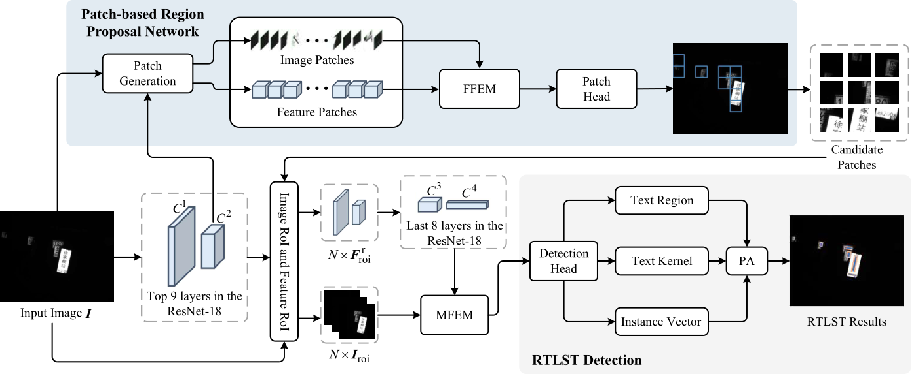

# Rail Transit Line-Sign Text Detection with Patch-based Region Proposal Network

This repo releases the code and dataset of "Rail Transit Line-Sign Text Detection with Patch-based Region Proposal Network". 
For more details, please refer to our paper.




## Environments
- Linux (tested on Ubuntu 18.04LTS)
- NVIDIA GPU (Tested on 1080Ti, 2080 Super, and 3090)
- Cuda (Tested on 10.1, 11.0 and 11.1)
- Pytorch (Tested on 3.7.13 and 3.8.6)

## Installation
First, clone the repository locally:

```shell
git clone https://github.com/whai362/pan_pp.pytorch.git
```

## Configuring your dataset


## Test and eval


## Visualizations of WHU-VHTR dataset

## Citation
```bash
If you find our method useful for your reserach, please cite
```
## License
